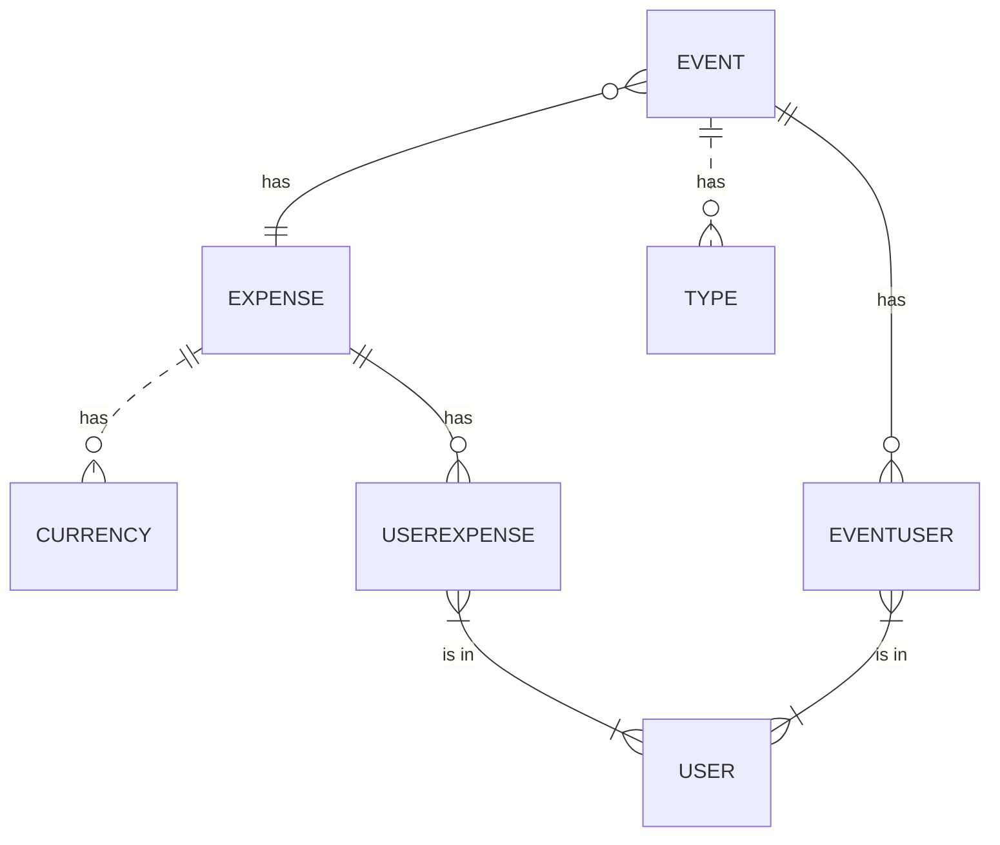
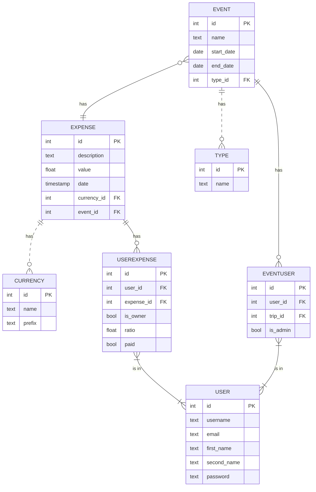

# Overview

An app for a group of people that plans a trip, event or general get-together and need to keep track of the expenses each of the individuals makes, the ida is to make clear who owns what to whom at the end.

## Problem Definition

When a group of friends or family prepare a trip or an event together, is hard to keep track manually of the expenses. The idea is to have a record for every expense, who made it, when, and who else is involve in it, and make a final tally of all the individual debts.

## Priorities

### Must have

- An Admin must be able to create an "Event". 
- A User must be able to sign-in to a specific Event.
- A User must be able to sign-up and login.
- A User must be able to add a Expenditure with name, date, value and a link to involved Users 
- A user must be able to see a tally of each debt status with another user.
- A User must be able to mark a debt as settled (open to revision).

### Should have

- A User should have the ability to see previous Events.
- An Admin should be able to mark the expenditures with status, specially "disputed". 
- A User should be able to edit a Expenditure.

### Could have

- A User could see a summary of all his tabs with the rest of the users.
- A user could select an icon or emoji to mark a expenditure.
- An Event could have a type (e.g. Trip, Diner)
- A User could be able to create a templated repeated expense.
- A User could select a date within a limited range.
- A User could split an Expenditure in different percentages each of the involved party.
- An Expenditure could have a specific currency.

### Will not have

- Connection with payment platforms
- Messaging tool for the users.

## Domain Model

### Entity Relationship Diagram

