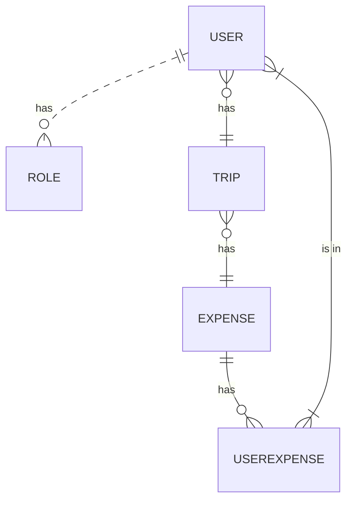
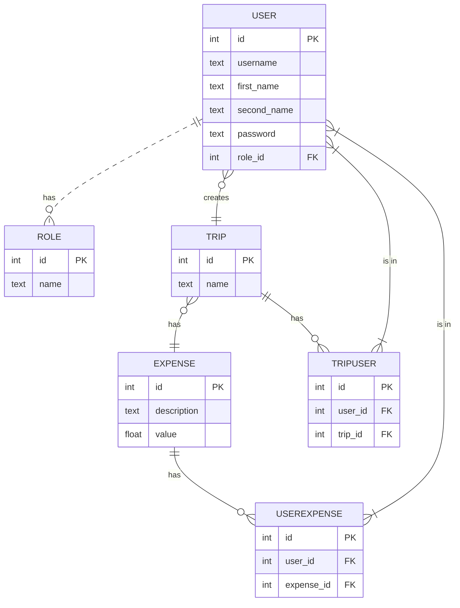

# Overview

An app that a whole group of people share, to keep track of the expenses of a shared trip and make clear who owns what to whom.

## Problem Definition

When a group of friends or family prepare a trip or party together, is hard to keep track manually of the expenses. The idea is to have a record for every expense, who made it, when, and who else it concern, and make a final tally of all the individual debts.

## Priorities

### Must have

- An admin must be able to create a "trip". 
- A user must be able to sign to a specific trip
- A user must be able to login
- A user must be able to add a expenditure with name, date, value and a link to other users 
- A user must be able to edit a expenditure.
- A user must be able to see a tally of each debt status with another user.

### Should have

- A user should be able to select a date from a date picker with a possible date range.
- A user should have the ability to see previous trips.
- A user should be able to easy split an expenditure en equal parts between all other users.
- A user should be able to create repeated expenses.
- An admin should be able to mark the expenditures with status, specially "in discussion". 

### Could have

- A user should be able to message another user about a expenditure.
- An admin can see a graph of all the debts between the party.
- A user could send a templated message to another user with the debts between them.
- A user could select an icon or emoji to mark a expenditure.

### Will not have

- Connection with payment platforms

## Domain Model

## Domain Model

### Entity Relationship Diagram

