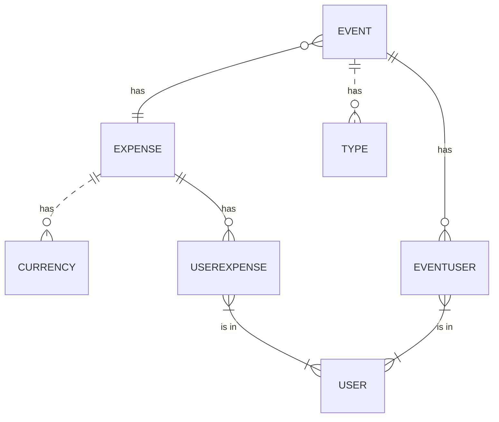
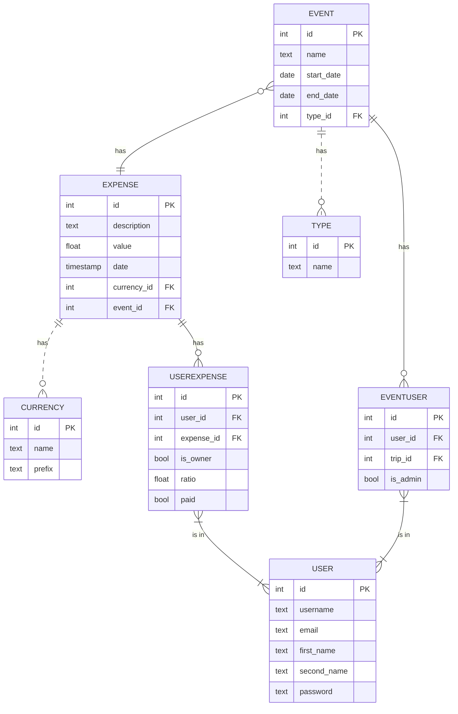

# Overview

An app for a group of people that plans a trip, event or general get-together and need to keep track of the expenses each of the individuals makes, the ida is to make clear who owns what to whom at the end.

## Problem Definition

When a group of friends or family prepare a trip or an event together, is hard to keep track manually of the expenses. The idea is to have a record for every expense, who made it, when, and who else is involve in it, and make a final tally of all the individual debts.

## Priorities

### Must have

- An Admin must be able to create an "Event".
- A User must be able to sign-in to a specific Event.
- A User must be able to sign-up and login.
- A User must be able to add a Expenditure with name, date, value and a link to involved Users
- A user must be able to see a tally of each debt status with another user.
- A User must be able to mark a debt as settled (open to revision).

### Should have

- A User should have the ability to see previous Events.
- An Admin should be able to mark the expenditures with status, specially "disputed".
- A User should be able to edit a Expenditure.

### Could have

- A User could see a summary of all his tabs with the rest of the users.
- A user could select an icon or emoji to mark a expenditure.
- An Event could have a type (e.g. Trip, Diner)
- A User could be able to create a templated repeated expense.
- A User could select a date within a limited range.
- A User could split an Expenditure in different percentages each of the involved party.
- An Expenditure could have a specific currency.

### Will not have

- Connection with payment platforms
- Messaging tool for the users.

## Domain Model



### Entity Relationship Diagram



## API Specification

### Users

`GET /user/{user_id}`

###### Retrieves a specific user by their ID.

Response: `200 OK`

```json
{
  "user_id": 1,
  "username": "andrewt",
  "email": "andrew@example.com",
  "first_name": "Andrew",
  "second_name": "Taylor",
  "password": "********"
}
```

---

`POST /user`

###### Creates a new user.

Request:

```json
{
  "username": "johnd",
  "email": "john@example.com",
  "first_name": "John",
  "second_name": "Doe",
  "password": "********"
}
```

Response: `201 Created`

```json
{
  "user_id": 2,
  "username": "johnd",
  "email": "john@example.com",
  "first_name": "John",
  "second_name": "Doe",
  "password": "********"
}
```

---

`PUT /user/{user_id}`

###### Updates an existing user.

Request:

```json
{
  "first_name": "Jane",
  "second_name": "Doe",
  "password": "********"
}
```

Response: `200 OK`

```json
{
  "user_id": 2,
  "username": "johnd",
  "email": "john@example.com",
  "first_name": "Jane",
  "second_name": "Doe",
  "password": "********"
}
```

---

`DELETE /user/{user_id}`

###### Deletes an existing user.

Response: `204 No Content`

---

`GET /user`

###### Retrieves a list of users.

Response: `200 OK`

```json
{
  "user_id": 1,
  "username": "andrewt",
  "email": "andrew@example.com",
  "first_name": "Andrew",
  "second_name": "Taylor",
  "password": "********"
},
{
  "user_id": 2,
  "username": "johnd",
  "email": "john@example.com",
  "first_name": "John",
  "second_name": "Doe",
  "password": "********"
}
```

---

---

### Events

`GET /event/{event_id}`

###### Retrieves a specific event by their ID.

Response: `200 OK`

```json
{
  "event_id": 1,
  "name": "Some Event",
  "start_date": "2023-05-01",
  "end_date": "2023-05-05",
  "type_id": 1
}
```

---

`POST /event`

###### Creates a new event.

Request:

```json
{
  "name": "New Event",
  "start_date": "2023-06-01",
  "end_date": "2023-06-05",
  "type_id": 1
}
```

Response: `201 Created`

```json
{
  "event_id": 2,
  "name": "New Event",
  "start_date": "2023-06-01",
  "end_date": "2023-06-05",
  "type_id": 1
}
```

---

`PUT /event/{event_id}`

###### Updates an existing event.

Request:

```json
{
  "name": "Updated Event",
  "start_date": "2023-07-01",
  "end_date": "2023-07-05",
  "type_id": 2
}
```

Response: `200 OK`

```json
{
  "event_id": 2,
  "name": "Updated Event",
  "start_date": "2023-07-01",
  "end_date": "2023-07-05",
  "type_id": 2
}
```

---

`DELETE /event/{event_id}`

###### Deletes an existing event.

Response: `204 No Content`

---

`GET /event`

###### Retrieves a list of events.

Response: `200 OK`

```json
{
  "event_id": 1,
  "name": "Some Event",
  "start_date": "2023-05-01",
  "end_date": "2023-05-05",
  "type_id": 1
},
{
  "event_id": 2,
  "name": "Updated Event",
  "start_date": "2023-07-01",
  "end_date": "2023-07-05",
  "type_id": 2
}
```

---

---

### Expenses

`GET /expense/{expense_id}`

###### Retrieves a specific expense by their ID.

Response: `200 OK`

```json
{
  "expense_id": 1,
  "description": "Some Expense",
  "value": 50.25,
  "date": "2023-05-10T14:30:00Z",
  "currency_id": 1,
  "event_id": 1
}
```

---

`POST /expense`

###### Creates a new expense.

Request:

```json
{
  "description": "New Expense",
  "value": 100.5,
  "date": "2023-06-15T10:00:00Z",
  "currency_id": 1,
  "event_id": 1
}
```

Response: `201 Created`

```json
{
  "expense_id": 2,
  "description": "New Expense",
  "value": 100.5,
  "date": "2023-06-15T10:00:00Z",
  "currency_id": 1,
  "event_id": 1
}
```

---

`PUT /expense/{expense_id}`

###### Updates an existing expense.

Request:

```json
{
  "description": "Updated Expense",
  "value": 75.0,
  "date": "2023-07-20T16:45:00Z",
  "currency_id": 2,
  "event_id": 2
}
```

Response: `200 OK`

```json
{
  "expense_id": 2,
  "description": "Updated Expense",
  "value": 75.0,
  "date": "2023-07-20T16:45:00Z",
  "currency_id": 2,
  "event_id": 2
}
```

---

`DELETE /expense/{expense_id}`

###### Deletes an existing expense.

Response: `204 No Content`

---

`GET /expense`

###### Retrieves a list of expenses.

Response: `200 OK`

```json
{
  "expense_id": 1,
  "description": "Some Expense",
  "value": 50.25,
  "date": "2023-05-10T14:30:00Z",
  "currency_id": 1,
  "event_id": 1
},
{
  "expense_id": 2,
  "description": "Updated Expense",
  "value": 75.0,
  "date": "2023-07-20T16:45:00Z",
  "currency_id": 2,
  "event_id": 2
}
```

---

---

### Currencies

`GET /currency/{currency_id}`

###### Retrieves a specific currency by their ID.

Response: `200 OK`

```json
{
  "currency_id": 1,
  "name": "USD",
  "prefix": "$"
}
```

---

`POST /currency`

###### Creates a new currency.

Request:

```json
{
  "name": "EUR",
  "prefix": "€"
}
```

Response: `201 Created`

```json
{
  "currency_id": 2,
  "name": "EUR",
  "prefix": "€"
}
```

---

`PUT /currency/{currency_id}`

###### Updates an existing currency.

Request:

```json
{
  "name": "GBP",
  "prefix": "£"
}
```

Response: `200 OK`

```json
{
  "currency_id": 2,
  "name": "GBP",
  "prefix": "£"
}
```

---

`DELETE /currency/{currency_id}`

###### Deletes an existing currency.

Response: `204 No Content`

---

`GET /currency`

###### Retrieves a list of currencies.

Response: `200 OK`

```json
{
  "currency_id": 1,
  "name": "USD",
  "prefix": "$"
},
{
  "currency_id": 2,
  "name": "GBP",
  "prefix": "£"
}
```

---

---

### Event Types

`GET /type/{type_id}`

###### Retrieves a specific type by their ID.

Response: `200 OK`

```json
{
  "type_id": 1,
  "name": "Trip"
}
```

---

`POST /type`

###### Creates a new type.

Request:

```json
{
  "name": "Dinner"
}
```

Response: `201 Created`

```json
{
  "type_id": 2,
  "name": "Dinner"
}
```

---

`PUT /type/{type_id}`

###### Updates an existing type.

Request:

```json
{
  "name": "Brunch"
}
```

Response: `200 OK`

```json
{
  "type_id": 2,
  "name": "Brunch"
}
```

---

`DELETE /types/{type_id}`

###### Deletes an existing type.

Response: `204 No Content`

---

`GET /type`

###### Retrieves a list of types.

Response: `200 OK`

```json
{
  "type_id": 1,
  "name": "Trip"
},
{
  "type_id": 2,
  "name": "Brunch"
}
```

---

---

### User Expense Relation

`GET /user_expense/{user_expense_id}`

###### Retrieves a specific user expense relation by their ID.

Response: `200 OK`

```json
{
  "user_expense_id": 1,
  "user_id": 1,
  "expense_id": 1,
  "is_owner": true,
  "ratio": 0.5,
  "paid": false
}
```

---

`GET /user_expense`

###### Retrieves a list of user expense relation relations.

Response: 200 OK

```json
[
  {
    "user_expense_id": 1,
    "user_id": 1,
    "expense_id": 1,
    "is_owner": true,
    "ratio": 0.5,
    "paid": false
  },
  {
    "user_expense_id": 2,
    "user_id": 2,
    "expense_id": 1,
    "is_owner": false,
    "ratio": 0.5,
    "paid": false
  }
]
```

---

`POST /user_expense`

###### Creates a new user expense relation.

Request

```json
{
  "user_id": 1,
  "expense_id": 2,
  "is_owner": true,
  "ratio": 0.3,
  "paid": false
}
```

Response: 201 Created

```json
{
  "user_expense_id": 3,
  "user_id": 1,
  "expense_id": 2,
  "is_owner": true,
  "ratio": 0.3,
  "paid": false
}
```

---

`PUT /user_expense/{user_expense_id}`

###### Updates an existing user expense relation.

Request

```json
{
  "is_owner": false,
  "ratio": 0.2,
  "paid": true
}
```

Response: 200 OK

```json

Status
{
  "user_expense_id": 3,
  "user_id": 1,
  "expense_id": 2,
  "is_owner": false,
  "ratio": 0.2,
  "paid": true
}
```

---

`DELETE /user_expense/{user_expense_id}`

###### Deletes an existing user expense relation.

Response: 204 No Content

---

---

### Event User Relations

`GET /event_user/{event_user_id}`

###### Retrieves a specific event user relation by their ID.

Response: `200 OK`

```json
{
  "event_user_id": 1,
  "user_id": 1,
  "event_id": 1,
  "is_admin": true
}
```

---

`GET /event_user`

###### Retrieves a list of event user relation relations.

Response: 200 OK

```json
[
  {
    "event_user_id": 1,
    "user_id": 1,
    "event_id": 1,
    "is_admin": true
  },
  {
    "event_user_id": 2,
    "user_id": 2,
    "event_id": 1,
    "is_admin": false
  }
]
```

---

`POST /event_user`

###### Creates a new event user relation.

Request

```json
{
  "user_id": 1,
  "event_id": 2,
  "is_admin": false
}
```

Response: 201 Created

```json
{
  "event_user_id": 3,
  "user_id": 1,
  "event_id": 2,
  "is_admin": false
}
```

---

`PUT /event_user/{event_user_id}`

###### Updates an existing event user relation.

Request

```json
{
  "is_admin": true
}
```

Response: 200 OK

```json
{
  "event_user_id": 3,
  "user_id": 1,
  "event_id": 2,
  "is_admin": true
}
```

---

`DELETE /event_user/{event_user_id}`

###### Deletes an existing event user relation.

Response: 204 No Content

---
